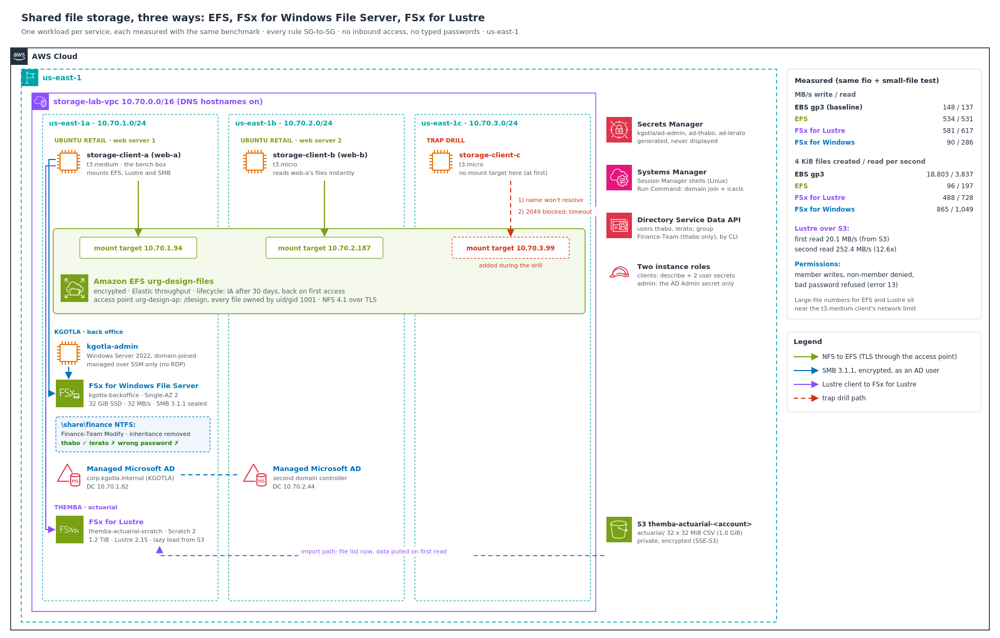

# Shared File Storage: EFS, FSx for Windows File Server and FSx for Lustre, chosen per workload and measured

In the same month, three clients asked me for "a shared drive", and each needed a different AWS service:

- **Ubuntu Retail Group's design team** kept product photos and campaign files on one web server's disk. The second web server couldn't see them, so half the site showed broken images after every upload, and a designer copied files between servers by hand.
- **Kgotla Financial Services' back office** (a Johannesburg payment processor) kept finance working papers on a file server under a desk. Access was "everyone who knows the path", and nobody could say who could open the reserving memos.
- **Themba Insurance's actuaries** copied a large policy-experience dataset from S3 to their laptops every quarter and waited hours before they could start modelling.

The wrong choice here is either slow, unusable for the team, or many times more expensive than it needs to be. So I built all three side by side in one VPC, proved each one's access model, and ran **the same benchmark on every one**, with the instance's own EBS disk as the baseline.

**Headline results**

| | Sequential write / read | 4 KiB files created / read per second | What it proved |
|---|---|---|---|
| EBS gp3 (one instance's disk, baseline) | 148 / 137 MB/s | **18,803 / 3,837** | Fast and local, but no one else can see it |
| **EFS** (Ubuntu Retail) | **534 / 531 MB/s** | 96 / 197 | A file written on web-a was readable on web-b instantly, owned by uid 1001 |
| **FSx for Windows** (Kgotla) | 90 / 286 MB/s | 865 / 1,049 | Finance-Team member allowed, non-member **denied**, wrong password **refused** |
| **FSx for Lustre** (Themba) | **581 / 617 MB/s** | 488 / 728 | Read the S3 dataset at 20.1 MB/s the first time, **252.4 MB/s** the second (12.6×) |

- **EFS and Lustre both delivered more than three times the baseline disk's large-file throughput**, but EFS created small files about **200 times more slowly** than local EBS. That decides what belongs on it: shared images, yes; build folders or session files, no.
- **The trap drill made both classic "EFS won't mount" failures happen on purpose.** From an AZ with no mount target, the name never resolves and the mount fails instantly. With port 2049 blocked, the name resolves and the mount hangs until it times out. Recognising which one you're looking at saves the first half hour of every ticket like it.
- **Every password was generated straight into Secrets Manager** and read by instance roles. None was typed, displayed or saved to disk. No instance had an inbound rule; every shell went through Session Manager or SSM Run Command, including the Windows server's.
- Built, measured and torn down the same day, with a clean check that came back empty.



---

## The problem I was solving

> Pick the right shared storage for each workload, prove the access controls work from the user's side, and back the recommendation with measured throughput and a cost per GB, not with "we always use EFS".

This continues work for the same clients: `saa-three-tier-web-app` built Ubuntu Retail's web tier, `aws-cloudtrail-config-governance` gave Kgotla an audit trail, and `aws-aurora-ha-architecture` took Themba's month-end reporting off the claims database. This project answers the file-storage half of each of those businesses.

---

## Four ideas the whole build depends on

1. **EBS is one disk for one instance in one AZ.** The moment two servers need the same files, you need a file system, not a disk.
2. **EFS is NFS for many Linux servers across AZs.** Each AZ needs its own **mount target** (a network interface with an IP in that subnet), and the file system's DNS name only resolves in AZs that have one. **Access points** give every client the same view and the same file ownership.
3. **FSx for Windows File Server is a real Windows file server.** It speaks SMB, joins Active Directory and enforces NTFS permissions. That's what a Windows back office already knows how to manage: users and groups, not IP addresses.
4. **FSx for Lustre is a high-performance scratch space that can sit on top of S3.** Linked to a bucket, it lists every object as a file immediately and pulls the bytes in the first time each file is read. Scratch file systems aren't replicated; they're built for a job and deleted after it.

---

## Architecture decisions

| Requirement | Decision | Why |
|---|---|---|
| Many Linux web servers, several AZs, one file tree | **EFS**, mount target in each AZ, NFS 4.1 over TLS | Regional, elastic, no capacity to manage |
| Every server writes files the same way | **EFS access point** enforcing uid/gid 1001 and root `/design` | Ownership doesn't depend on which server or user wrote the file |
| Old campaign files should cost less | **EFS lifecycle**: Infrequent Access after 30 days, back on first access | About 95% cheaper per GB for files nobody opens |
| Throughput that follows the workload | **EFS Elastic throughput** | No burst credits to run out of, billed per GB moved |
| Windows users, AD accounts, NTFS permissions | **FSx for Windows** joined to **AWS Managed Microsoft AD** | Permissions are managed where Kgotla already manages people |
| "Who can open the memos?" answered by AD | **NTFS ACL on `\finance`** for the `Finance-Team` group, inheritance removed | Group membership is the access list, auditable in one place |
| Manage users without Windows tools | **Directory Service Data API** (`aws ds-data`) | Users and groups created and audited from the CLI |
| Manage NTFS without RDP | **Domain-joined admin server driven by SSM Run Command** | `icacls` runs on the server; no port 3389, no key pair |
| Fast scratch over an S3 dataset | **FSx for Lustre Scratch 2**, S3 import path, Lustre 2.15 | No copy step; data loads on first read; deleted after the run |
| No passwords anywhere | Generated into **Secrets Manager**; roles read only the secrets they need | Nothing typed, nothing displayed, nothing on disk |
| Encrypted at rest and in transit | EFS encrypted + TLS mounts; SMB 3.1.1 with `seal`; FSx and S3 encrypted at rest | Personal and financial data on every one of them |
| Nothing reachable from outside | No inbound rules on any instance; every storage rule SG-to-SG | Each service admits only the clients' security group on its own ports |

Long-form reasoning is in [`docs/adr/`](docs/adr). The diagram uses the **official AWS Architecture Icons** and is generated from [`docs/diagram/build_architecture.py`](docs/diagram/build_architecture.py). The icon pack itself isn't committed: AWS licenses it for diagrams, not redistribution.

---

## How I measured it

I wrote [`client/fstool.py`](client/fstool.py), installed on every Linux client at boot. It finds each file system by its Name tag through the instance role, so no ID, IP address or password is ever typed.

| Command | What it does |
|---|---|
| `fstool mount efs \| lustre \| smb <user>` | Mounts EFS through the access point with TLS, Lustre by its DNS and mount name, or the Windows share as an AD user over SMB 3.1.1 with encryption (the password goes from Secrets Manager into a root-only file that's deleted straight after mounting) |
| `fstool bench <dir> <label>` | `fio`: 4 jobs × 256 MiB sequential write (with a final fsync), page cache dropped, then the same files read back. Then 1,000 × 4 KiB files created and read. Every result is saved to CSV |
| `fstool hydrate` | Reads the whole Lustre dataset twice, page cache dropped between reads, with `lfs hsm_state` before and after |
| `fstool nfs-test` | A plain NFS mount of EFS by its DNS name, limited to 25 seconds, then unmounted: the trap drill |
| `fstool dataset` | Builds 32 × 32 MiB policy-experience CSV files and uploads them to S3 |

The benchmark ran from one t3.medium client (`storage-client-a`) against all four targets, so the comparison is like for like. Its limits are covered in [`docs/benchmarks.md`](docs/benchmarks.md).

---

## What I proved

| Test | Result | Evidence |
|---|---|---|
| Instance types checked per AZ before building | ✅ t3.medium and t3.micro both offered in 1a, 1b and 1c (neither in 1e) | [`01`](docs/screenshots/01-step0-account-and-az-offerings.png) |
| Network and security groups | ✅ 3 subnets in 3 AZs; 4 groups; 9 rules, all SG-to-SG | [`02`](docs/screenshots/02-step1-vpc-and-three-subnets.png)–[`05`](docs/screenshots/05-step1-nine-sg-to-sg-rules.png) |
| EFS built for the design team | ✅ Encrypted, Elastic, lifecycle IA after 30 days, mount targets 1a + 1b, access point `/design` as 1001 | [`11`](docs/screenshots/11-step5-efs-lifecycle-access-point.png), [`12`](docs/screenshots/12-step5-efs-mount-targets-1a-1b.png) |
| **Two web servers, one file system** | ✅ web-a wrote the brief; web-b (other AZ) read it and appended; web-a saw both lines. Files owned by `1001 1001` though root wrote them | [`13`](docs/screenshots/13-step6-web-a-mounts-and-writes.png)–[`15`](docs/screenshots/15-step6-ebs-and-efs-benchmarks.png) |
| **Trap 1: AZ with no mount target** | ✅ `Failed to resolve server ... Name or service not known`, in 0.0 s | [`16`](docs/screenshots/16-step7-drill-no-mount-target-dns-fails.png) |
| Fix 1: mount target in 1c | ✅ Name resolves to `10.70.3.99`; mounted in 0.5 s | [`17`](docs/screenshots/17-step7-drill-mount-target-1c-created.png), [`18`](docs/screenshots/18-step7-drill-dns-propagates-mounted.png) |
| **Trap 2: port 2049 blocked** | ✅ Name resolves, nothing answers: **timed out after 25 s** | [`19`](docs/screenshots/19-step7-drill-revoke-2049.png), [`20`](docs/screenshots/20-step7-drill-timed-out.png) |
| Fix 2: rule restored | ✅ Mounted in 0.2 s | [`21`](docs/screenshots/21-step7-drill-restore-2049.png), [`22`](docs/screenshots/22-step7-drill-mounted-again.png) |
| Lustre linked to the S3 dataset | ✅ Scratch 2, 1,200 GiB, Lustre 2.15, import path set; 32 objects (1.0 GiB) | [`23`](docs/screenshots/23-step8-actuarial-dataset-in-s3.png), [`24`](docs/screenshots/24-step8-lustre-scratch2-available.png) |
| **Lazy load from S3** | ✅ `released exists archived` → read 1,073.7 MB in 53.5 s (20.1 MB/s) → `exists archived` → second read in 4.3 s (252.4 MB/s), **12.6×** | [`25`](docs/screenshots/25-step9-lustre-lazy-load-hydration.png) |
| Directory and users | ✅ Managed AD `corp.kgotla.internal` Active (DCs in 1a + 1b); thabo and lerato created; Finance-Team = thabo only | [`06`](docs/screenshots/06-step2-managed-ad-creating.png), [`27`](docs/screenshots/27-step10-ad-active-fsx-windows-created.png), [`28`](docs/screenshots/28-step10-ad-users-and-finance-team.png) |
| Passwords never seen | ✅ Generated into Secrets Manager; reset from the secret inside the command | [`29`](docs/screenshots/29-step10-user-passwords-from-secrets.png) |
| Admin server joined over SSM | ✅ `Domain join succeeded`, `PartOfDomain : True`, in 62 s; no RDP | [`30`](docs/screenshots/30-step10-admin-server-domain-joined.png) |
| FSx for Windows | ✅ Single-AZ 2, 32 GiB, 32 MB/s, joined to the directory | [`31`](docs/screenshots/31-step10-fsx-windows-available.png) |
| **NTFS: Finance-Team only** | ✅ Exactly four entries: Finance-Team (M), Admin (F), AWS Delegated FSx Administrators (F), SYSTEM (F) | [`32`](docs/screenshots/32-step11-ntfs-acl-finance-team-only.png) |
| **Permissions from the user's side** | ✅ thabo wrote the memo; lerato: `Permission denied` on `finance\`, but allowed at the share root; wrong password: `mount error(13)` | [`33`](docs/screenshots/33-step12-smb-mounts-and-bad-password.png), [`34`](docs/screenshots/34-step12-thabo-allowed-lerato-denied.png) |
| All four benchmarks | ✅ One table, same test | [`35`](docs/screenshots/35-step12-smb-benchmark-and-results.png) |
| Teardown | ✅ Every clean-check query empty | [`36`](docs/screenshots/36-step14-teardown-storage-and-instances.png)–[`39`](docs/screenshots/39-step14-clean-check.png) |

**Build evidence:** private dataset bucket ([`07`](docs/screenshots/07-step3-dataset-bucket-private.png)), two least-privilege instance roles ([`08`](docs/screenshots/08-step3-two-instance-roles.png)), boot script and four instances ([`09`](docs/screenshots/09-step4-amis-and-userdata.png), [`10`](docs/screenshots/10-step4-four-instances.png)), Lustre benchmark ([`26`](docs/screenshots/26-step9-lustre-benchmark.png)).

Walkthroughs: [`docs/efs-shared-web-tier.md`](docs/efs-shared-web-tier.md), [`docs/fsx-windows-ad-permissions.md`](docs/fsx-windows-ad-permissions.md), [`docs/lustre-over-s3.md`](docs/lustre-over-s3.md), [`docs/benchmarks.md`](docs/benchmarks.md).

---

## Which one, when

| Workload looks like… | Use | Not |
|---|---|---|
| One server's data: database files, boot volume, scratch | **EBS** | EFS (slower per operation, dearer per GB) |
| Many Linux servers sharing files across AZs: web assets, CMS uploads, shared home directories | **EFS** | EBS (one instance), FSx for Windows (SMB) |
| Windows users, mapped drives, AD groups, NTFS permissions | **FSx for Windows File Server** | EFS (NFS, Linux only) |
| Compute jobs that hammer a large dataset: risk models, ML training, rendering | **FSx for Lustre**, linked to S3 | Copying the data to every node |
| Thousands of tiny files written constantly: build directories, sessions | Local EBS (or a cache) | EFS: 96 file creates a second against EBS's 18,803 |
| Data that's written once and read by applications over HTTP | **S3** | Any file system: S3 is object storage, and that's its strength |

---

## Debugging along the way

- **AWS refused the directory name.** `corp.kgotla.example` failed with `InvalidParameterException`: `*.example`, `*.invalid` and `*.localhost` are reserved. I used `corp.kgotla.internal`, which is set aside for private networks.
- **The cloud-init status check needed root.** As `ssm-user`, `cloud-init status --wait` crashed with `PermissionError` on `/run/cloud-init/cloud.cfg`; `sudo cloud-init status --wait` worked.
- **A fresh terminal has no saved values.** `start-session --target "$CLIENT_A"` failed with a zero-length target because that terminal hadn't loaded `env.sh`. From then on I opened every client terminal with one chained line: `cd ~/shared-storage && source ./env.sh && aws ssm start-session --target "$CLIENT_A"`.
- **A new EFS mount target isn't resolvable straight away.** My first retry after creating the 1c mount target still failed to resolve; the next one got `10.70.3.99`. AWS documents up to 90 seconds for the DNS record.
- **Two security groups blocked each other's deletion.** The Lustre group allowed the clients' group, and the clients' group allowed Lustre's callbacks. Each delete failed with `DependencyViolation` until I revoked both groups' rules first.
- **Planned around:** Amazon Linux 2023's Lustre 2.15 client refuses 2.10 file systems, and 2.10 is the Scratch default, so I created the file system as 2.15. The client SG needs inbound 988/1018–1023 from the Lustre SG. Clients connect to the Windows share by IP, because the directory's DNS names don't resolve through the VPC's own resolver.

Full notes: [`docs/debugging-journey.md`](docs/debugging-journey.md).

---

## Cost

Three services here bill **by the hour while they exist**, so I built, measured and tore down in one sitting.

| Item | Rate (us-east-1 list price, approx.) | This build |
|---|---|---|
| AWS Managed Microsoft AD (Standard) | ~US$0.12/hour (2 domain controllers) | ~2 hours |
| FSx for Windows, 32 GiB SSD + 32 MB/s | ~US$0.13/GB-month + ~US$2.20 per MB/s-month (≈ US$0.10/hour) | ~1 hour |
| FSx for Lustre Scratch 2, 1.2 TiB | ~US$0.14/GB-month (≈ US$0.23/hour) | ~1 hour |
| EC2: 1 Windows + 3 Linux | ~US$0.14/hour together | ~2 hours |
| EFS (Elastic) | per GB stored + per GB read/written | a few GB moved |
| S3, Secrets Manager | per GB / per secret-month | cents |
| **Total (estimate)** | | **about US$1–2** |

At the clients' real sizes the picture changes, and the minimums matter more than the per-GB price. For example, a 32 GiB Windows share costs about US$75 a month, and US$70 of that is the throughput, not the storage. Details: [`docs/cost-model.md`](docs/cost-model.md).

---

## Compliance & frameworks

All three datasets are sensitive: customer design work, a financial services firm's working papers, and policyholder experience data. This build maps to:

- **POPIA §19 (South Africa)**: appropriate technical measures for personal information. Encryption at rest and in transit on every service, access by role and AD group, no shared or typed passwords.
- **PCI DSS v4.0** (Kgotla, a payment processor, where back-office data falls in scope)
  - **Req 7.2**: access by business need, enforced with an AD group on the folder.
  - **Req 8.2 / 8.3**: individual AD accounts, strong generated passwords; a wrong password is refused.
- **ISO/IEC 27001:2022 Annex A**
  - **A.5.15 Access control** and **A.8.3 Information access restriction**: NTFS by group, EFS ownership by access point.
  - **A.5.17 Authentication information**: secrets generated into Secrets Manager, never displayed.
  - **A.8.24 Use of cryptography**: TLS to EFS, SMB 3.1.1 encryption, encrypted file systems and bucket.
  - **A.8.20 Networks security**: SG-to-SG rules only, no inbound access to instances.
  - **A.8.10 Information deletion**: scratch data deleted with the Lustre file system after the run.
- **NIST SP 800-53 Rev. 5**
  - **AC-3** access enforcement and **AC-6** least privilege (two roles, each limited to its own secrets).
  - **IA-2 / IA-5**: identification and authenticator management through AD and Secrets Manager.
  - **SC-7** boundary protection, **SC-8** transmission confidentiality, **SC-28** protection at rest.
- **NIST Cybersecurity Framework 2.0**
  - **PR.AA-05**: least-privilege access.
  - **PR.DS-01 / PR.DS-02**: data at rest and in transit protected.
  - **PR.IR-01**: networks protected from unauthorised access.
- **CIS AWS Foundations Benchmark**: EFS encrypted at rest; S3 public access blocked.
- **SOC 2 (AICPA Trust Services Criteria)**: **CC6.1** logical access, **CC6.7** protection of data in transmission.

---

## Repo layout

```
.
├── README.md
├── env.sh.example                    # copy to env.sh (git-ignored); saved IDs + the save() helper
├── client/
│   ├── fstool.py                     # mount + measure tool for the Linux clients (embedded at boot)
│   └── userdata.sh.tpl               # boot script: efs-utils, cifs-utils, fio, lustre-client, fstool
├── windows/
│   └── set-finance-acl.ps1.tpl       # NTFS permissions on \share\finance, run over SSM Run Command
├── scripts/
│   ├── build_userdata.py             # embeds fstool (gzip + base64), refuses anything over 16 KB
│   ├── new_secret.py                 # random password straight into Secrets Manager; prints only the ARN
│   ├── ssm_run.py                    # domain join / PowerShell on the Windows server, waits, prints output
│   ├── render.py                     # fills @@NAME@@ placeholders; refuses to leave any empty
│   └── kit_aws.py                    # shared helper (repo-relative paths)
├── policies/
│   ├── ec2-trust.json
│   ├── client-perms.json.tpl         # describe file systems, 2 user secrets, the dataset prefix
│   └── admin-perms.json.tpl          # the AD Admin secret only
└── docs/
    ├── architecture.png / .svg       # official AWS Architecture Icons
    ├── diagram/                      # build_architecture.py + awsdiag.py
    ├── efs-shared-web-tier.md
    ├── fsx-windows-ad-permissions.md
    ├── lustre-over-s3.md
    ├── benchmarks.md
    ├── debugging-journey.md
    ├── cost-model.md
    ├── teardown.md
    ├── adr/                          # 6 architecture decision records
    └── screenshots/                  # 39 build, drill, test and teardown screenshots, in order
```

> **No account IDs are committed.** Templates use `@@NAME@@` placeholders filled at run time, and account IDs are masked in the screenshots. There is no `Deny` statement anywhere, and nothing has deletion protection, so teardown can't lock anyone out.

---

## Reproduce it

From WSL, in `us-east-1`, as an administrator:

1. From the repo folder: `cp env.sh.example env.sh && mkdir -p build && source env.sh`. Save `ACCOUNT_ID` and `BUCKET`, and check the instance types are offered in each AZ you'll use.
2. VPC `10.70.0.0/16` with **DNS hostnames enabled**; subnets in 1a, 1b and 1c; security groups for clients, EFS (2049), FSx Windows (445, 5985) and Lustre (988, 1018–1023 from clients and itself; clients accept the same from Lustre).
3. `python3 scripts/new_secret.py kgotla/ad-admin`, then `aws ds create-microsoft-ad` (a non-reserved domain name) with the password read from the secret. Start it early: it takes 20–45 minutes.
4. Bucket; both roles from the templates; `python3 scripts/build_userdata.py`; three AL2023 clients (one per AZ) and one Windows Server 2022 admin server, IMDSv2, no key pairs.
5. EFS (encrypted, Elastic, lifecycle), mount targets in 1a and 1b, access point `/design` as 1001. On two clients: `fstool mount efs`, write on one, read on the other; `fstool bench`.
6. Trap drill from the 1c client: `fstool nfs-test`, add the 1c mount target, retest; revoke 2049, retest; restore, retest.
7. `fstool dataset`, then Lustre `SCRATCH_2` with `--file-system-type-version 2.15` and `ImportPath=s3://$BUCKET/actuarial`; `fstool mount lustre`, `fstool hydrate`, `fstool bench`.
8. Directory Active: FSx for Windows (Single-AZ 2, 32 GiB, 32 MB/s); `aws ds enable-directory-data-access`; users and `Finance-Team` with `aws ds-data`; passwords via `new_secret.py` and `aws ds reset-user-password`; `python3 scripts/ssm_run.py join "$WIN_ID"`.
9. Render and run `windows/set-finance-acl.ps1.tpl` with `ssm_run.py ps`; then `fstool mount smb thabo`, `smb lerato`, `smb lerato --bad-password`, the folder tests, and `fstool bench`.
10. Teardown the same day: [`docs/teardown.md`](docs/teardown.md).

---

## What this connects to

- `saa-three-tier-web-app`: Ubuntu Retail's web tier. EFS is what lets its Auto Scaling group serve the same uploads from every instance.
- `aws-kms-encryption-architecture`: every file system here is encrypted at rest. The next step for Kgotla is a customer-managed key on the FSx file system.
- `aws-aurora-ha-architecture`: Themba's databases. Lustre is the compute-side counterpart for the actuarial models.
- `aws-private-connectivity-endpoints`: the clients here still use an internet route for package installs and AWS APIs. VPC endpoints would remove it.
- **Next:** hybrid access, with Storage Gateway, DataSync and Transfer Family, for the on-premises side of the same file shares.
